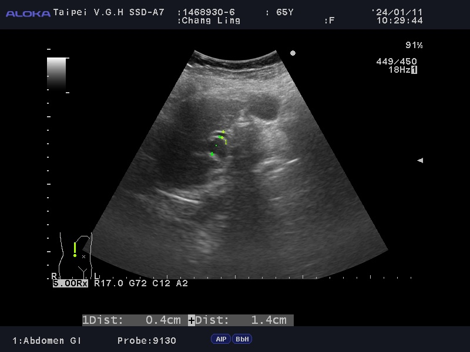

# DICOM Report — 14689306_unknown_IMG00018

> **Chart ID:** `14689306`  
> **Label:** `unknown`  
> **Generated:** 2026-06-05 21:15:51  
> **Source file:** `IMG00018.dcm`  
> **Image:** [14689306_unknown_IMG00018.jpg](./14689306_unknown_IMG00018.jpg)

---

## Key Fields

| Field | Value |
|-------|-------|
| **PatientName** | `<unreadable>` |
| **PatientID** | `<unreadable>` |
| **PatientBirthDate** | `<unreadable>` |
| **PatientSex** | `<unreadable>` |
| **PatientAge** | `<unreadable>` |
| **StudyDate** | `<unreadable>` |
| **StudyTime** | `<unreadable>` |
| **StudyDescription** | `<unreadable>` |
| **StudyInstanceUID** | `<unreadable>` |
| **SeriesDate** | `<unreadable>` |
| **SeriesTime** | `<unreadable>` |
| **SeriesNumber** | `<unreadable>` |
| **Modality** | `<unreadable>` |
| **InstitutionName** | `<unreadable>` |
| **ReferringPhysicianName** | `<unreadable>` |
| **Manufacturer** | `<unreadable>` |
| **ManufacturerModelName** | `<unreadable>` |
| **SOPClassUID** | `<unreadable>` |
| **SOPInstanceUID** | `<unreadable>` |
| **Rows** | `<unreadable>` |
| **Columns** | `<unreadable>` |
| **PixelSpacing** | `<unreadable>` |
| **BitsAllocated** | `<unreadable>` |
| **BitsStored** | `<unreadable>` |
| **PixelRepresentation** | `<unreadable>` |
| **PhotometricInterpretation** | `<unreadable>` |
| **SamplesPerPixel** | `<unreadable>` |
| **BodyPartExamined** | `<unreadable>` |
| **TransducerData** | `<unreadable>` |
| **InstanceNumber** | `<unreadable>` |

---

## All DICOM Tags

| Tag | Keyword | VR | Value |
|-----|---------|----|-------|
| `(0008,0005)` | SpecificCharacterSet | CS | `ISO_IR 192` |
| `(0008,0008)` | ImageType | CS | `['DERIVED', 'PRIMARY', '', '0001']` |
| `(0008,0016)` | SOPClassUID | UI | `1.2.840.10008.5.1.4.1.1.7` |
| `(0008,0018)` | SOPInstanceUID | UI | `1.2.840.113817.1900.100.1.20240111103008563.18` |
| `(0008,0020)` | StudyDate | DA | `` |
| `(0008,0021)` | SeriesDate | DA | `` |
| `(0008,0023)` | ContentDate | DA | `` |
| `(0008,0030)` | StudyTime | TM | `` |
| `(0008,0031)` | SeriesTime | TM | `` |
| `(0008,0033)` | ContentTime | TM | `` |
| `(0008,0050)` | AccessionNumber | SH | `` |
| `(0008,0060)` | Modality | CS | `US` |
| `(0008,0070)` | Manufacturer | LO | `DV` |
| `(0008,0080)` | InstitutionName | LO | `` |
| `(0008,0090)` | ReferringPhysicianName | PN | `` |
| `(0008,1010)` | StationName | SH | `phy02` |
| `(0008,1030)` | StudyDescription | LO | `ABDOMEN SONOGRAM(SELF-PAY)` |
| `(0008,1070)` | OperatorsName | PN | `` |
| `(0008,1090)` | ManufacturerModelName | LO | `SSD-ALPHA7` |
| `(0008,2111)` | DerivationDescription | ST | `Aware J2k Library, version 3.19.1.7` |
| `(0010,0010)` | PatientName | PN | `` |
| `(0010,0020)` | PatientID | LO | `` |
| `(0010,0021)` | IssuerOfPatientID | LO | `` |
| `(0010,0030)` | PatientBirthDate | DA | `` |
| `(0010,0032)` | PatientBirthTime | TM | `` |
| `(0010,0040)` | PatientSex | CS | `` |
| `(0010,1000)` | OtherPatientIDs | LO | `` |
| `(0010,1001)` | OtherPatientNames | PN | `` |
| `(0010,1010)` | PatientAge | AS | `` |
| `(0010,1030)` | PatientWeight | DS | `1` |
| `(0010,2000)` | MedicalAlerts | LO | `` |
| `(0010,2110)` | Allergies | LO | `` |
| `(0018,0015)` | BodyPartExamined | CS | `` |
| `(0018,1020)` | SoftwareVersions | LO | `['00-6.2.2', 'Prism.L_DICOMLib Ver08.00.00[20110420]']` |
| `(0018,1030)` | ProtocolName | LO | `Abdomen` |
| `(0018,1164)` | ImagerPixelSpacing | DS | `0` |
| `(0018,5010)` | TransducerData | LO | `['9130', '', '']` |
| `(0018,5050)` | DepthOfScanField | IS | `170` |
| `(0018,6011)` | SequenceOfUltrasoundRegions | SQ | `<sequence 0 items>` |
| `(0018,6031)` | TransducerType | CS | `CURVED LINEAR` |
| `(0020,000D)` | StudyInstanceUID | UI | `1.2.840.113817.1900.100.2024011110262362` |
| `(0020,000E)` | SeriesInstanceUID | UI | `1.2.840.113817.1900.100.1.2024011110262362` |
| `(0020,0010)` | StudyID | SH | `` |
| `(0020,0011)` | SeriesNumber | IS | `1` |
| `(0020,0013)` | InstanceNumber | IS | `18` |
| `(0028,0002)` | SamplesPerPixel | US | `3` |
| `(0028,0004)` | PhotometricInterpretation | CS | `YBR_RCT` |
| `(0028,0006)` | PlanarConfiguration | US | `0` |
| `(0028,0010)` | Rows | US | `600` |
| `(0028,0011)` | Columns | US | `800` |
| `(0028,0030)` | PixelSpacing | US | `0` |
| `(0028,0100)` | BitsAllocated | US | `8` |
| `(0028,0101)` | BitsStored | US | `8` |
| `(0028,0102)` | HighBit | US | `7` |
| `(0028,0103)` | PixelRepresentation | US | `0` |
| `(0032,1032)` | RequestingPhysician | PN | `DOC1501B` |
| `(0032,1033)` | RequestingService | LO | `PHY` |
| `(0032,1060)` | RequestedProcedureDescription | LO | `ABDOMEN SONOGRAM(SELF-PAY)` |
| `(0032,4000)` | StudyComments | LT | `ABDOMEN SONOGRAM(SELF-PAY)` |
| `(0038,0050)` | SpecialNeeds | LO | `` |