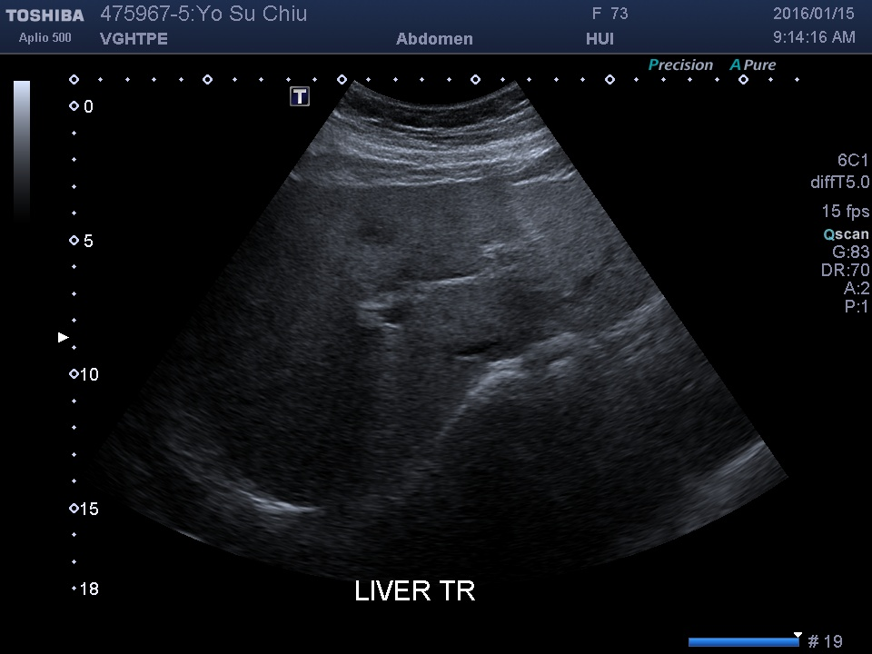

# DICOM Report — 4759675_unknown_IMG00005

> **Chart ID:** `4759675`  
> **Label:** `unknown`  
> **Generated:** 2026-06-05 21:16:07  
> **Source file:** `IMG00005.dcm`  
> **Image:** [4759675_unknown_IMG00005.jpg](./4759675_unknown_IMG00005.jpg)

---

## Calibration (Ultrasound Region)

| Parameter | Value |
|-----------|-------|
| **mm per pixel (X)** | `-0.338912` |
| **mm per pixel (Y)** | `0.338912` |
| **px per mm** | `-2.9506` |
| **Scan region (px)** | `X: 64–895,  Y: 88–647` |

---

## Key Fields

| Field | Value |
|-------|-------|
| **PatientName** | `<unreadable>` |
| **PatientID** | `<unreadable>` |
| **PatientBirthDate** | `<unreadable>` |
| **PatientSex** | `<unreadable>` |
| **PatientAge** | `<unreadable>` |
| **StudyDate** | `<unreadable>` |
| **StudyTime** | `<unreadable>` |
| **StudyDescription** | `<unreadable>` |
| **StudyInstanceUID** | `<unreadable>` |
| **SeriesDate** | `<unreadable>` |
| **SeriesTime** | `<unreadable>` |
| **SeriesDescription** | `<unreadable>` |
| **SeriesNumber** | `<unreadable>` |
| **Modality** | `<unreadable>` |
| **InstitutionName** | `<unreadable>` |
| **ReferringPhysicianName** | `<unreadable>` |
| **Manufacturer** | `<unreadable>` |
| **ManufacturerModelName** | `<unreadable>` |
| **SOPClassUID** | `<unreadable>` |
| **SOPInstanceUID** | `<unreadable>` |
| **Rows** | `<unreadable>` |
| **Columns** | `<unreadable>` |
| **BitsAllocated** | `<unreadable>` |
| **BitsStored** | `<unreadable>` |
| **PixelRepresentation** | `<unreadable>` |
| **PhotometricInterpretation** | `<unreadable>` |
| **SamplesPerPixel** | `<unreadable>` |
| **BodyPartExamined** | `<unreadable>` |
| **AcquisitionDate** | `<unreadable>` |
| **AcquisitionTime** | `<unreadable>` |
| **TransducerData** | `<unreadable>` |
| **UltrasoundColorDataPresent** | `<unreadable>` |
| **InstanceNumber** | `<unreadable>` |

---

## All DICOM Tags

| Tag | Keyword | VR | Value |
|-----|---------|----|-------|
| `(0008,0005)` | SpecificCharacterSet | CS | `ISO_IR 100` |
| `(0008,0008)` | ImageType | CS | `['DERIVED', 'PRIMARY', 'ABDOMINAL', '0001']` |
| `(0008,0012)` | InstanceCreationDate | DA | `20160115` |
| `(0008,0013)` | InstanceCreationTime | TM | `091416.867` |
| `(0008,0014)` | InstanceCreatorUID | UI | `1.2.392.200036.9116.6.18.15552579` |
| `(0008,0016)` | SOPClassUID | UI | `1.2.840.10008.5.1.4.1.1.6.1` |
| `(0008,0018)` | SOPInstanceUID | UI | `1.2.392.200036.9116.6.18.15552579.5001.20160115011416881.3.827` |
| `(0008,0020)` | StudyDate | DA | `` |
| `(0008,0021)` | SeriesDate | DA | `` |
| `(0008,0022)` | AcquisitionDate | DA | `` |
| `(0008,0023)` | ContentDate | DA | `` |
| `(0008,0030)` | StudyTime | TM | `` |
| `(0008,0031)` | SeriesTime | TM | `` |
| `(0008,0032)` | AcquisitionTime | TM | `` |
| `(0008,0033)` | ContentTime | TM | `` |
| `(0008,0050)` | AccessionNumber | SH | `` |
| `(0008,0060)` | Modality | CS | `US` |
| `(0008,0070)` | Manufacturer | LO | `TOSHIBA_MEC_US` |
| `(0008,0080)` | InstitutionName | LO | `` |
| `(0008,0081)` | InstitutionAddress | ST | `` |
| `(0008,0090)` | ReferringPhysicianName | PN | `` |
| `(0008,1010)` | StationName | SH | `A500_2015` |
| `(0008,1030)` | StudyDescription | LO | `SONO- HEPATOBILIARY SYSTEM` |
| `(0008,103E)` | SeriesDescription | LO | `` |
| `(0008,1040)` | InstitutionalDepartmentName | LO | `` |
| `(0008,1048)` | PhysiciansOfRecord | PN | `` |
| `(0008,1050)` | PerformingPhysicianName | PN | `` |
| `(0008,1060)` | NameOfPhysiciansReadingStudy | PN | `` |
| `(0008,1070)` | OperatorsName | PN | `` |
| `(0008,1080)` | AdmittingDiagnosesDescription | LO | `34` |
| `(0008,1090)` | ManufacturerModelName | LO | `TUS-A500` |
| `(0008,1111)` | ReferencedPerformedProcedureStepSequence | SQ | `<sequence 1 items>` |
| `(0008,2111)` | DerivationDescription | ST | `Aware J2k Library, version 3.19.1.7` |
| `(0010,0010)` | PatientName | PN | `` |
| `(0010,0020)` | PatientID | LO | `` |
| `(0010,0021)` | IssuerOfPatientID | LO | `` |
| `(0010,0030)` | PatientBirthDate | DA | `` |
| `(0010,0032)` | PatientBirthTime | TM | `` |
| `(0010,0040)` | PatientSex | CS | `` |
| `(0010,1000)` | OtherPatientIDs | LO | `` |
| `(0010,1001)` | OtherPatientNames | PN | `` |
| `(0010,1005)` | PatientBirthName | PN | `` |
| `(0010,1010)` | PatientAge | AS | `` |
| `(0010,1020)` | PatientSize | DS | `None` |
| `(0010,1030)` | PatientWeight | DS | `None` |
| `(0010,1040)` | PatientAddress | LO | `` |
| `(0010,1060)` | PatientMotherBirthName | PN | `` |
| `(0010,1080)` | MilitaryRank | LO | `` |
| `(0010,1081)` | BranchOfService | LO | `` |
| `(0010,1090)` | MedicalRecordLocator | LO | `` |
| `(0010,2000)` | MedicalAlerts | LO | `` |
| `(0010,2110)` | Allergies | LO | `` |
| `(0010,2150)` | CountryOfResidence | LO | `` |
| `(0010,2152)` | RegionOfResidence | LO | `` |
| `(0010,2154)` | PatientTelephoneNumbers | SH | `` |
| `(0010,2160)` | EthnicGroup | SH | `` |
| `(0010,2180)` | Occupation | SH | `` |
| `(0010,21A0)` | SmokingStatus | CS | `` |
| `(0010,21B0)` | AdditionalPatientHistory | LT | `` |
| `(0010,21D0)` | LastMenstrualDate | DA | `` |
| `(0010,21F0)` | PatientReligiousPreference | LO | `` |
| `(0010,4000)` | PatientComments | LT | `Insurance=
` |
| `(0018,0015)` | BodyPartExamined | CS | `` |
| `(0018,1000)` | DeviceSerialNumber | LO | `W5B1552579` |
| `(0018,1020)` | SoftwareVersions | LO | `AB_V5.10*R102` |
| `(0018,1030)` | ProtocolName | LO | `Abdomen` |
| `(0018,1088)` | HeartRate | IS | `0` |
| `(0018,5010)` | TransducerData | LO | `['PVT-375BT', '', '']` |
| `(0018,5012)` | FocusDepth | DS | `8.640` |
| `(0018,5022)` | MechanicalIndex | DS | `1.2` |
| `(0018,5024)` | BoneThermalIndex | DS | `0.4` |
| `(0018,5027)` | SoftTissueThermalIndex | DS | `0.4` |
| `(0018,5050)` | DepthOfScanField | IS | `180` |
| `(0018,6011)` | SequenceOfUltrasoundRegions | SQ | `<sequence 1 items>` |
| `(0018,6031)` | TransducerType | CS | `CURVED LINEAR` |
| `(0020,000D)` | StudyInstanceUID | UI | `1.2.840.113817.20160115.47596715.1300838.661` |
| `(0020,000E)` | SeriesInstanceUID | UI | `1.2.392.200036.9116.6.18.15552579.9500.20160115011254908.2.34` |
| `(0020,0010)` | StudyID | SH | `` |
| `(0020,0011)` | SeriesNumber | IS | `1` |
| `(0020,0013)` | InstanceNumber | IS | `5` |
| `(0020,0020)` | PatientOrientation | CS | `` |
| `(0020,4000)` | ImageComments | LT | `` |
| `(0028,0002)` | SamplesPerPixel | US | `3` |
| `(0028,0004)` | PhotometricInterpretation | CS | `YBR_RCT` |
| `(0028,0006)` | PlanarConfiguration | US | `0` |
| `(0028,0010)` | Rows | US | `720` |
| `(0028,0011)` | Columns | US | `960` |
| `(0028,0014)` | UltrasoundColorDataPresent | US | `1` |
| `(0028,0100)` | BitsAllocated | US | `8` |
| `(0028,0101)` | BitsStored | US | `8` |
| `(0028,0102)` | HighBit | US | `7` |
| `(0028,0103)` | PixelRepresentation | US | `0` |
| `(0028,0301)` | BurnedInAnnotation | CS | `YES` |
| `(0028,2110)` | LossyImageCompression | CS | `00` |
| `(0032,1000)` | ScheduledStudyStartDate | DA | `` |
| `(0032,1001)` | ScheduledStudyStartTime | TM | `` |
| `(0032,1032)` | RequestingPhysician | PN | `O P D 2 2 Q` |
| `(0032,1033)` | RequestingService | LO | `GS` |
| `(0032,1060)` | RequestedProcedureDescription | LO | `SONO- HEPATOBILIARY SYSTEM` |
| `(0032,4000)` | StudyComments | LT | `` |
| `(0038,0050)` | SpecialNeeds | LO | `` |
| `(0038,0500)` | PatientState | LO | `` |
| `(0040,0244)` | PerformedProcedureStepStartDate | DA | `20160115` |
| `(0040,0245)` | PerformedProcedureStepStartTime | TM | `091254.936` |
| `(0040,0253)` | PerformedProcedureStepID | SH | `15016520` |
| `(0040,0254)` | PerformedProcedureStepDescription | LO | `SONO- HEPATOBILIARY SYSTEM` |
| `(0040,0275)` | RequestAttributesSequence | SQ | `<sequence 1 items>` |
| `(0040,3001)` | ConfidentialityConstraintOnPatientDataDescription | LO | `` |