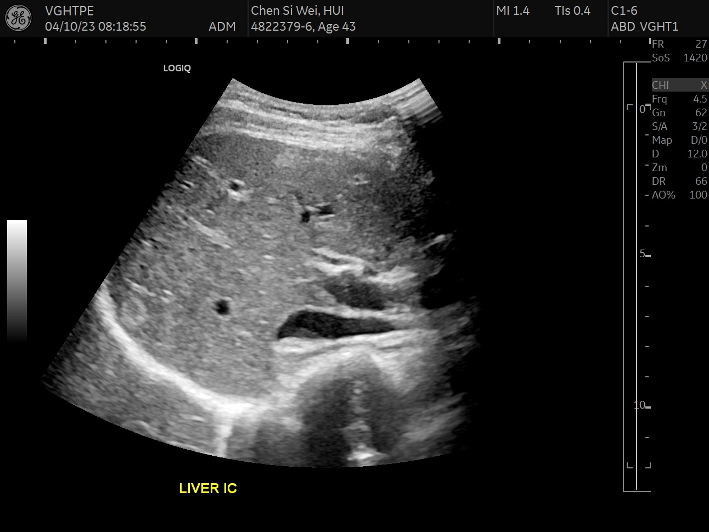

# DICOM Report — 48223796_LIVERIC_IMG00190

> **Chart ID:** `48223796`  
> **Label:** `LIVERIC`  
> **Generated:** 2026-06-05 21:15:31  
> **Source file:** `IMG00190.dcm`  
> **Image:** [48223796_LIVERIC_IMG00190.jpg](./48223796_LIVERIC_IMG00190.jpg)

---

## Calibration (Ultrasound Region)

| Parameter | Value |
|-----------|-------|
| **mm per pixel (X)** | `0.181171` |
| **mm per pixel (Y)** | `0.181171` |
| **px per mm** | `5.5197` |
| **Scan region (px)** | `X: 2–1185,  Y: 113–895` |

---

## Key Fields

| Field | Value |
|-------|-------|
| **PatientName** | `<unreadable>` |
| **PatientID** | `<unreadable>` |
| **PatientBirthDate** | `<unreadable>` |
| **PatientSex** | `<unreadable>` |
| **PatientAge** | `<unreadable>` |
| **StudyDate** | `<unreadable>` |
| **StudyTime** | `<unreadable>` |
| **StudyDescription** | `<unreadable>` |
| **StudyInstanceUID** | `<unreadable>` |
| **SeriesDate** | `<unreadable>` |
| **SeriesTime** | `<unreadable>` |
| **SeriesDescription** | `<unreadable>` |
| **SeriesNumber** | `<unreadable>` |
| **Modality** | `<unreadable>` |
| **InstitutionName** | `<unreadable>` |
| **ReferringPhysicianName** | `<unreadable>` |
| **Manufacturer** | `<unreadable>` |
| **ManufacturerModelName** | `<unreadable>` |
| **SOPClassUID** | `<unreadable>` |
| **SOPInstanceUID** | `<unreadable>` |
| **Rows** | `<unreadable>` |
| **Columns** | `<unreadable>` |
| **BitsAllocated** | `<unreadable>` |
| **BitsStored** | `<unreadable>` |
| **PixelRepresentation** | `<unreadable>` |
| **PhotometricInterpretation** | `<unreadable>` |
| **SamplesPerPixel** | `<unreadable>` |
| **BodyPartExamined** | `<unreadable>` |
| **TransducerData** | `<unreadable>` |
| **UltrasoundColorDataPresent** | `<unreadable>` |
| **InstanceNumber** | `<unreadable>` |

---

## All DICOM Tags

| Tag | Keyword | VR | Value |
|-----|---------|----|-------|
| `(0008,0005)` | SpecificCharacterSet | CS | `ISO_IR 192` |
| `(0008,0008)` | ImageType | CS | `['DERIVED', 'PRIMARY', 'ABDOMINAL', '0001', 'GEMSSINGLEFRAME', 'GEMSMGCOUNT1']` |
| `(0008,0016)` | SOPClassUID | UI | `1.2.840.10008.5.1.4.1.1.6.1` |
| `(0008,0018)` | SOPInstanceUID | UI | `1.2.840.113619.2.455.140911791833.1681085940.206` |
| `(0008,0020)` | StudyDate | DA | `` |
| `(0008,0021)` | SeriesDate | DA | `` |
| `(0008,0023)` | ContentDate | DA | `` |
| `(0008,0030)` | StudyTime | TM | `` |
| `(0008,0031)` | SeriesTime | TM | `` |
| `(0008,0033)` | ContentTime | TM | `` |
| `(0008,0050)` | AccessionNumber | SH | `` |
| `(0008,0060)` | Modality | CS | `US` |
| `(0008,0070)` | Manufacturer | LO | `GE Healthcare` |
| `(0008,0080)` | InstitutionName | LO | `` |
| `(0008,0090)` | ReferringPhysicianName | PN | `` |
| `(0008,1010)` | StationName | SH | `GELE10-2019` |
| `(0008,1030)` | StudyDescription | LO | `SONOGRAM- WHOLE ABDOMEN` |
| `(0008,103E)` | SeriesDescription | LO | `SONOGRAM- WHOLE ABDOMEN` |
| `(0008,1040)` | InstitutionalDepartmentName | LO | `` |
| `(0008,1050)` | PerformingPhysicianName | PN | `` |
| `(0008,1070)` | OperatorsName | PN | `` |
| `(0008,1090)` | ManufacturerModelName | LO | `LOGIQE10` |
| `(0008,2111)` | DerivationDescription | ST | `Aware J2k Library, version 3.19.1.7` |
| `(0010,0010)` | PatientName | PN | `` |
| `(0010,0020)` | PatientID | LO | `` |
| `(0010,0030)` | PatientBirthDate | DA | `` |
| `(0010,0032)` | PatientBirthTime | TM | `` |
| `(0010,0040)` | PatientSex | CS | `` |
| `(0010,1000)` | OtherPatientIDs | LO | `` |
| `(0010,1001)` | OtherPatientNames | PN | `` |
| `(0010,1010)` | PatientAge | AS | `` |
| `(0018,0015)` | BodyPartExamined | CS | `` |
| `(0018,1000)` | DeviceSerialNumber | LO | `501343US7` |
| `(0018,1020)` | SoftwareVersions | LO | `LOGIQE10:R2.5.2` |
| `(0018,1088)` | HeartRate | IS | `-1` |
| `(0018,5010)` | TransducerData | LO | `['C1-6', '575', '394477YP4']` |
| `(0018,6011)` | SequenceOfUltrasoundRegions | SQ | `<sequence 1 items>` |
| `(0018,6031)` | TransducerType | CS | `CURVED LINEAR` |
| `(0020,000D)` | StudyInstanceUID | UI | `1.2.840.113817.850931096201811.1248223796.20230410080000` |
| `(0020,000E)` | SeriesInstanceUID | UI | `1.2.840.113619.2.455.140911791833.1681085781.187` |
| `(0020,0010)` | StudyID | SH | `` |
| `(0020,0011)` | SeriesNumber | IS | `1` |
| `(0020,0013)` | InstanceNumber | IS | `190` |
| `(0020,0020)` | PatientOrientation | CS | `` |
| `(0028,0002)` | SamplesPerPixel | US | `3` |
| `(0028,0004)` | PhotometricInterpretation | CS | `YBR_RCT` |
| `(0028,0006)` | PlanarConfiguration | US | `0` |
| `(0028,0010)` | Rows | US | `970` |
| `(0028,0011)` | Columns | US | `1292` |
| `(0028,0014)` | UltrasoundColorDataPresent | US | `0` |
| `(0028,0100)` | BitsAllocated | US | `8` |
| `(0028,0101)` | BitsStored | US | `8` |
| `(0028,0102)` | HighBit | US | `7` |
| `(0028,0103)` | PixelRepresentation | US | `0` |
| `(0028,2110)` | LossyImageCompression | CS | `00` |
| `(0032,1033)` | RequestingService | LO | `NOSE` |
| `(0032,1060)` | RequestedProcedureDescription | LO | `SONOGRAM- WHOLE ABDOMEN` |
| `(0040,0260)` | PerformedProtocolCodeSequence | SQ | `<sequence 1 items>` |
| `(0040,0275)` | RequestAttributesSequence | SQ | `<sequence 1 items>` |
| `(2050,0020)` | PresentationLUTShape | CS | `IDENTITY` |